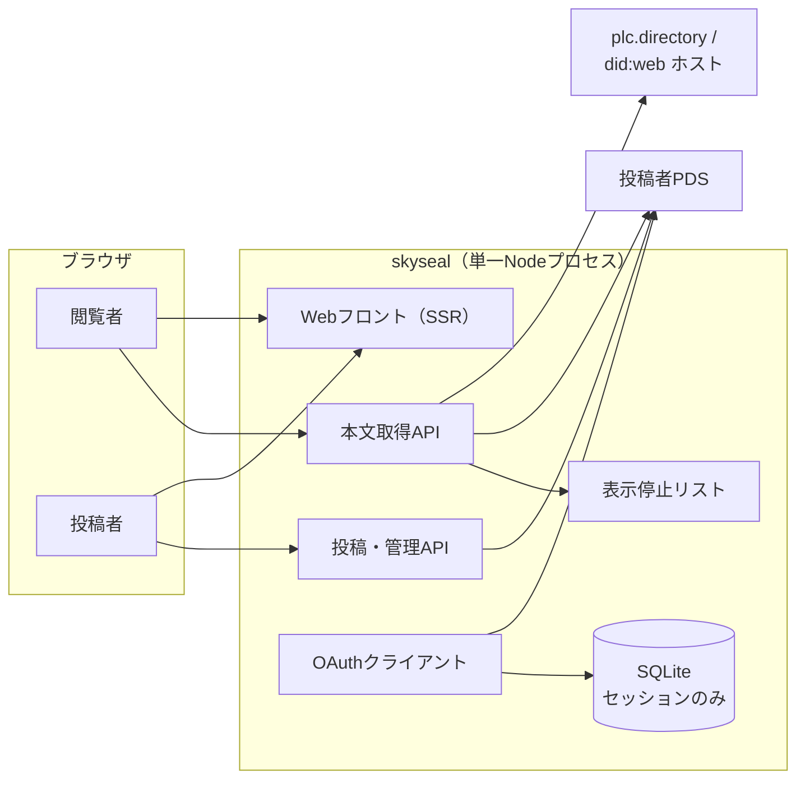

# アーキテクチャ概要

[MVP要件定義書](../requirements/mvp.md) に基づく基本設計。技術スタックは [ADR 0004](../adr/0004-tech-stack-typescript-hono.md) を前提とする。

## 1. システム構成

skysealは単一のNodeプロセスとして動作するWebサービスであり、外部システムとして投稿者のPDS・DIDレゾルバ（plc.directory等）とのみ通信する。

要点：

- **本文の正本は投稿者PDSにのみ存在する。** skysealはネタバレ本文を恒久保存せず、SQLiteに保存するのはOAuthセッション情報だけ（要件7.2）。
- 閲覧経路はサービスAPI経由に一本化する（[ADR-0002](../adr/0002-fetch-spoiler-via-service-api.md)）。ブラウザは投稿者PDSと直接通信しない。
- Bluesky AppView（`api.bsky.app`）には依存しない。投稿者情報（ハンドル・表示名）もDIDドキュメントとPDSから直接取得する。

## 2. コンポーネント分割

| コンポーネント | 責務 | 設計文書 |
| --- | --- | --- |
| Webフロント（SSR） | 全画面のHTML描画。固定メタデータ・セキュリティヘッダの付与 | [screens.md](./screens.md) |
| OAuthクライアント / セッション管理 | AT Protocol OAuth（granular scope）、アプリセッション、CSRF対策 | [oauth-session.md](./oauth-session.md) |
| 投稿・管理API | 本文レコード+案内投稿の一括作成・一括削除、自分の投稿一覧 | [screens.md](./screens.md)、[lexicon.md](./lexicon.md) |
| 本文取得API | DID解決→PDSからのレコード取得→検証→返却。表示停止判定とレート制限 | [content-api.md](./content-api.md) |
| 表示停止リスト | 運営者が管理する識別子リストの読み込みと照合 | [content-api.md](./content-api.md) |

## 3. 主要データフロー

### 3.1 投稿（要件6.5）

1. 投稿者がログイン済みセッションで本文を送信する。
2. skysealが本文レコード用と案内投稿用のTID（レコードキー）を2つ生成する。
3. DIDと本文レコード用TIDから専用URL `https://skyseal.mp0.jp/p/{did}/{rkey}` を組み立てる。
4. `com.atproto.repo.applyWrites` で `jp.mp0.skyseal.post`（本文）と `app.bsky.feed.post`（案内投稿）を**1回の呼び出しで**作成する。applyWritesは単一リポジトリへの原子的コミットであり、片方だけ成功する状態は生じない。
5. 失敗時は何も作成されなかったものとして扱い、投稿画面で本文を保持したままエラー表示する（要件6.2）。

### 3.2 閲覧（要件6.6、ADR-0002）

1. 閲覧者が `/p/{did}/{rkey}` を開く。サーバーは表示可否を判定し、表示できない場合は理由を区別せずHTTP 404の固定メッセージページを返す（要件6.6）。表示できる場合は、固定文言のみで本文を含まない初期HTMLを返す。
2. ページ内のスクリプトが同一オリジンの本文取得APIを呼ぶ。
3. APIは表示停止判定→DID解決→PDSからレコード取得→形式検証を行い、本文をそのまま返す（永続化・キャッシュ・ログ出力なし）。
4. APIも表示できない場合は理由を区別せず404の固定メッセージを返す。

### 3.3 削除（要件6.8）

1. 投稿者が管理画面で対象を選び削除を実行する。
2. skysealが案内投稿（`announcementRkey`）の存在を確認する。
3. 両方存在すれば applyWrites で2レコードを一括削除、案内投稿が既に無ければ本文レコードのみ削除する。

## 4. データストア

SQLite（単一ファイル）に保存するのは以下のみ。

| テーブル | 内容 | 保持期間 |
| --- | --- | --- |
| `oauth_session` | `@atproto/oauth-client-node` のセッション（トークン・DPoP鍵）。値は暗号化 | ログアウト・失効まで |
| `oauth_state` | OAuth認可フロー中の一時state | フロー完了まで（短TTL） |
| `app_session` | アプリセッションID、DID、有効期限、CSRFシークレット | 有効期限まで |

表示停止リストは設定ファイル（後述）であり、DBには置かない。ネタバレ本文はいかなるテーブル・ログにも書き込まない（要件7.1、7.2）。

## 5. セキュリティ方針（要件7.3）

全ページ共通のレスポンスヘッダ：

| ヘッダ | 値 |
| --- | --- |
| `Content-Security-Policy` | `default-src 'none'; script-src 'self'; style-src 'self'; img-src 'self'; connect-src 'self'; base-uri 'none'; form-action 'self'; frame-ancestors 'none'` |
| `X-Frame-Options` | `DENY` |
| `Referrer-Policy` | `strict-origin-when-cross-origin` |

`connect-src 'self'` が成立するのは本文取得をサービスAPI経由に一本化しているため（ADR-0002）。

専用ページ（`/p/*`）と本文取得APIには追加で以下を付与する（要件6.7）。

| ヘッダ | 値 |
| --- | --- |
| `X-Robots-Tag` | `noindex, nosnippet, noarchive` |
| `Cache-Control` | `no-store` |

注意：`robots.txt` で `/p/` をクロール拒否**しない**。クロールを拒否すると `noindex` がクローラに読まれず、URLだけがインデックスされ得るため。

本文の描画はテキストノードへの代入（`textContent`）のみで行い、HTMLとして解釈しない（要件7.3「HTMLエスケープして表示」を満たす実装方式。改行は `white-space: pre-wrap` で保持する）。

## 6. ログ・監視方針（要件7.1）

- アプリケーションログ・エラーログには、リクエストボディおよびPDSレスポンスボディを**出力しない**。例外はメッセージと種別のみ記録し、レコード内容を含めない。
- HTTPアクセスログはメソッド・パス・ステータス・所要時間のみとする。パス（`/p/{did}/{rkey}`）は識別子であり本文を含まないため記録してよい。
- メトリクスは件数・レイテンシ等の集計値のみ（要件7.2）。

## 7. 設定（環境変数・ファイル）

| 設定 | 形式 | 内容 |
| --- | --- | --- |
| `SKYSEAL_ORIGIN` | env | サービスオリジン（`https://skyseal.mp0.jp`） |
| `SKYSEAL_DB_PATH` | env | SQLiteファイルパス |
| `SKYSEAL_ENCRYPTION_KEY` | env | OAuthセッション暗号化鍵（AES-256-GCM用、32バイト） |
| `SKYSEAL_OAUTH_PRIVATE_KEYS` | env | OAuthクライアント認証用秘密鍵（JWK。[oauth-session.md](./oauth-session.md)） |
| `SKYSEAL_TRUSTED_PROXIES` | env | 信頼するリバースプロキシのCIDR（[content-api.md 5.](./content-api.md)） |
| `SKYSEAL_DENYLIST_PATH` | env | 表示停止リストファイルのパス |
| 表示停止リスト | JSONファイル | [content-api.md](./content-api.md) 参照 |

## 8. MVPで決めないこと

- ホスティング先（ADR 0004の結果を参照。決定時に別ADR）
- 独自Lexiconのスキーマ公開（`com.atproto.lexicon.schema`）の実施時期 — 機構は [lexicon.md](./lexicon.md) に記載
