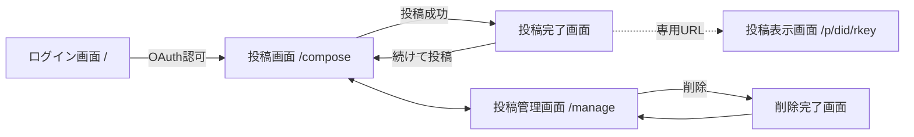

# 画面・ルーティング設計

[MVP要件定義書 5章・6章・8章](../requirements/mvp.md) の基本設計。全画面はサーバーサイドレンダリング（SSR）とし、クライアントJSを使うのは専用ページの本文取得と投稿画面のバイト数カウントのみ（[ADR 0004](../adr/0004-tech-stack-typescript-hono.md)）。

## 1. ルート一覧

| メソッド・パス | 画面 / 機能 | 認証 |
| --- | --- | --- |
| `GET /` | ログイン画面（ログイン済みなら `/compose` へリダイレクト） | 不要 |
| `POST /oauth/login` | ハンドル受け取り→OAuth認可へリダイレクト | 不要 |
| `GET /oauth/callback` | OAuthコールバック | 不要 |
| `GET /oauth/client-metadata.json` | クライアントメタデータ公開 | 不要 |
| `GET /oauth/jwks.json` | クライアント認証用公開鍵集合（JWKS）の公開（[oauth-session.md 1.](./oauth-session.md)） | 不要 |
| `GET /compose` | 投稿画面 | 必要 |
| `POST /compose` | 投稿作成（成功時 `/compose/done/{rkey}` へリダイレクト） | 必要 + CSRF |
| `GET /compose/done/{rkey}` | 投稿完了画面 | 必要 |
| `GET /p/{did}/{rkey}` | 投稿表示画面（専用ページ） | 不要 |
| `GET /api/p/{did}/{rkey}` | 本文取得API（[content-api.md](./content-api.md)） | 不要 |
| `GET /manage` | 投稿管理画面 | 必要 |
| `POST /manage/delete` | 削除実行（成功時 `/manage/deleted` へリダイレクト） | 必要 + CSRF |
| `GET /manage/deleted` | 削除完了画面 | 必要 |
| `POST /logout` | ログアウト | 必要 + CSRF |
| `GET /terms` | 利用規約 | 不要 |
| `GET /privacy` | プライバシーポリシー | 不要 |

- 認証必須ルートに未ログインでアクセスした場合は `/` へリダイレクトする。
- POSTはすべてPRG（Post/Redirect/Get）とし、リロードによる二重投稿・二重削除を防ぐ。
- 全ページのフッターに `/terms`・`/privacy` へのリンクを置く（要件6.10「各画面から到達できる」）。

## 2. 画面遷移

## 3. 各画面の設計

### 3.1 ログイン画面（`GET /`）

- サービスの簡単な説明（本文は専用ページで公開されること、Blueskyには固定文言だけが投稿されること）。
- ハンドル入力欄と「Blueskyでログイン」ボタン。
- エラー表示領域：ハンドル解決失敗、granular scope未対応PDS（[oauth-session.md 2.](./oauth-session.md)）、認可拒否。

### 3.2 投稿画面（`GET /compose`）

- 入力欄はネタバレ本文のテキストエリア**のみ**（要件6.2。受入基準4）。
- 固定の説明文：「この本文は専用ページで公開されます。Blueskyの通常投稿には本文は表示されません。」
- 残り入力可能量の表示：クライアントJSが `TextEncoder` でUTF-8バイト数を数え、残りバイト数と文字数換算の目安を表示する。JS無効環境でもサーバー側検証だけで投稿自体は成立する。
- サーバー側検証：空・空白のみを拒否、7,500バイト超を拒否。
- 投稿失敗時：同じ画面を本文入力値を保持したまま再描画し、エラーを表示する（要件6.2）。

### 3.3 投稿完了画面（`GET /compose/done/{rkey}`）

- 専用ページURL（コピー用）と、Bluesky案内投稿へのリンク（`https://bsky.app/profile/{did}/post/{announcementRkey}`）を表示する。
- `announcementRkey` はセッションのDIDで本文レコードを `getRecord` して得る。レコードが確認できない場合は404。
- 「続けて投稿する」「投稿を管理する」への導線。

### 3.4 投稿表示画面（`GET /p/{did}/{rkey}`）

- サーバーはまず本文取得APIと同じ表示可否判定（[content-api.md 2.](./content-api.md) の1〜5。実装を共有する）を行う。表示できない場合は**HTTPステータス404**で固定メッセージ「この投稿は表示できません。」のページを返す（要件6.6、受入基準9）。判定中に取得した本文はレスポンスに含めず破棄する（本文はリクエスト処理中のみ保持。要件7.2）。
- 表示できる場合は200で初期HTMLを返す。初期HTMLは固定要素のみ：固定ページタイトル「ネタバレ投稿」、固定OGP、読み込み中表示、案内投稿リンク用のプレースホルダ。**本文・投稿者情報を含めない**（要件6.7）。
- 読み込み後、クライアントJSが `GET /api/p/{did}/{rkey}` を呼び、本文（`textContent` で挿入、`white-space: pre-wrap` で改行保持）、投稿日時、表示名またはハンドル（なければDID）、案内投稿リンクを描画する。
- APIが404の場合（ページ表示後にレコードが削除された等の競合時）：「この投稿は表示できません。」のみを表示する。
- APIが429の場合：時間をおいて再読み込みするよう固定文言を表示する。
- 1回の閲覧でPDSへのレコード取得が2回（SSR判定時とAPI呼び出し時）発生するが、要件6.6の404応答を満たすためのコストとして許容する。`/p/*` はページ・APIともレート制限の対象とする（[content-api.md 5.](./content-api.md)）。
- OGP・検索対策ヘッダは [architecture.md 5.](./architecture.md) のとおり。

### 3.5 投稿管理画面（`GET /manage`）

- 自分の `jp.mp0.skyseal.post` レコードを `com.atproto.repo.listRecords`（新しい順、50件 + 「さらに表示」のカーソルページング）で一覧する。
- 各行の表示：投稿日時、本文の冒頭（50字程度で切り詰め）、専用ページへのリンク、削除ボタン（確認ダイアログ付きフォーム）。
- 削除対象選択のためだけの一覧であり、検索・並び替え・絞り込みは付けない（要件6.8）。

### 3.6 削除完了画面（`GET /manage/deleted`）

- 削除が完了した旨と、削除済みデータの限界（既取得データ等は消えないこと。要件6.8）の固定注記。
- 管理画面へ戻る導線。

### 3.7 規約ページ（`GET /terms`、`GET /privacy`）

- 静的ページ。記載内容は要件6.10（取り扱いデータの範囲、本文が投稿者PDS上の公開データであること、表示停止の根拠、連絡手段）。
- 運営者への連絡手段は、skyseal公式のBlueskyアカウントとする（アカウントは公開前に作成する）。
- 文面のドラフトは [terms-and-privacy.md](./terms-and-privacy.md) を参照。

## 5. UI共通方針

- スタイルは自前CSSのみで構成する。CSPが `style-src 'self'` のため（[architecture.md 5.](./architecture.md)）、外部CDNのCSSフレームワーク・Webフォントは使わず、フォントはシステムフォントスタックとする。
- **ダークモードに対応する。** `prefers-color-scheme` に追従し、配色はCSSカスタムプロパティ（デザイントークン）で定義して全画面で共有する。手動切り替えUIは設けない。
- 専用ページの本文は長文の読みやすさを優先する（適切な行長・行間、`white-space: pre-wrap`）。

## 4. 投稿・削除処理の詳細

### 4.1 投稿作成（`POST /compose`）

1. CSRFトークンと本文を検証する。
2. TIDを2つ生成する（本文レコード用 `rkeyPost`、案内投稿用 `rkeyAnnounce`）。
3. `com.atproto.repo.applyWrites` を1回呼び、以下を原子的に作成する（要件6.5）。
   - `jp.mp0.skyseal.post/{rkeyPost}` — `text`、`createdAt`、`announcementRkey: rkeyAnnounce`
   - `app.bsky.feed.post/{rkeyAnnounce}` — [lexicon.md 2.](./lexicon.md) の固定内容（URLは `rkeyPost` から生成）
4. 成功時、applyWritesが返したURIから `rkeyPost` を確認し、`/compose/done/{rkeyPost}` へリダイレクトする。
5. 失敗時（PDSエラー、権限不足、ネットワーク）、本文を保持して投稿画面を再描画する。エラーメッセージに本文・PDSレスポンス生値を含めない。

### 4.2 削除（`POST /manage/delete`）

1. CSRFトークンと `rkey` を検証し、セッションのDIDで本文レコードを `getRecord` する（`announcementRkey` の取得を兼ねる）。存在しなければ「すでに削除済み」として削除完了画面へ。
2. 案内投稿 `app.bsky.feed.post/{announcementRkey}` を取得し、**skysealが生成した固定形式であることを検証する**：本文が固定テンプレート（[lexicon.md 2.](./lexicon.md)）に一致し、含まれるURLが削除対象の本文レコード（同一DID・同一 `rkey`）の専用URLであること。
   - 本文レコードは投稿者自身や他アプリでも作成・改変できるため、`announcementRkey` を無条件に信用すると、無関係なBluesky投稿を巻き添えで削除し得る。検証に一致しない投稿は削除対象に**含めない**。
3. 案内投稿が存在し検証に一致すれば applyWrites で2件を一括削除、案内投稿が存在しない・検証に一致しない場合は本文レコードのみ削除する（要件6.8）。
4. applyWrites には `swapCommit`（手順1〜2で観測したコミットCID）を指定し、確認と削除の間にリポジトリが変化していた場合は失敗させて手順1からやり直す（TOCTOU対策）。
5. `/manage/deleted` へリダイレクトする。
